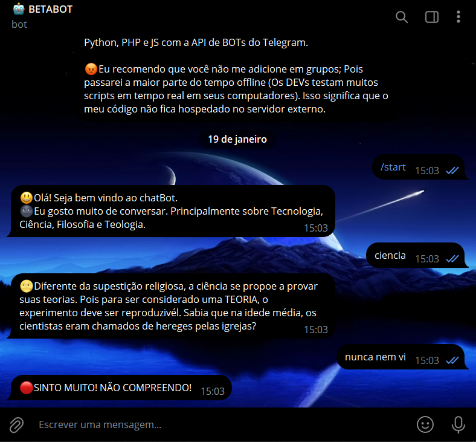
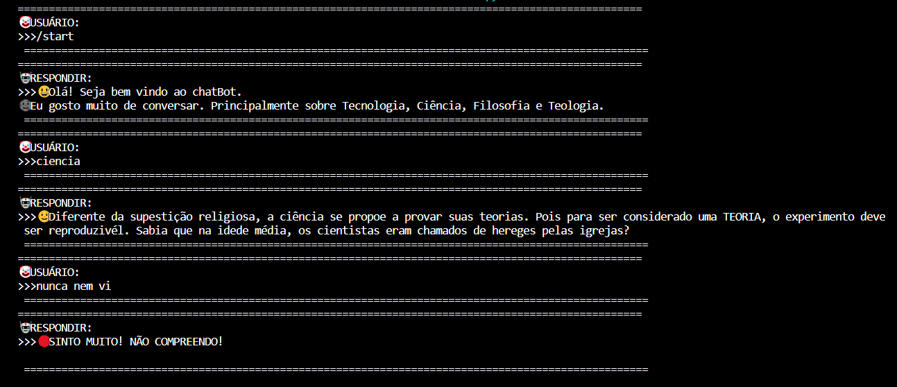

# CHAT DE CONSOLE
🤤É UM BOT DE BATE PAPO SOBRE TÓPICOS RELACIONADOS!

 <br>
> O BOT CONVERSA COM USUÁRIO SOBRE TÓPICOS RELACIONADOS!

 <br>
> TANTO A MENSAGEM DO USUÁRIO QUANTO A RESPOSTA DO BOT SÃO EXIBIDAS NO CONSOLE.

## DESCRIÇÃO:
O bot recebe mensagens de texto dos usuários e responde com informações relacionadas aos tópicos especificados.

## FUNCIONALIDADES:
- O bot responde a mensagens de texto com base em algumas palavras-chave, como tecnologia, ciência, filosofia e teologia.

- Ele fornece informações sobre os tópicos mencionados, juntamente com algumas mensagens predefinidas.

- O bot envia respostas de volta para o usuário que enviou a mensagem original.

- Você recebe a mensagem que o usuário enviou no PV do bot dentro do console da sua IDE (Ou servidor). Daí você pode responde-lo diretamente pela IDE.

### EXECUTANDO O PROJETO:
1. **Coloque o Token:**
   - Antes de executar o programa, é necessário substituir o token do seu bot, o qual pode ser obtido por meio do [@BotFather](https://t.me/BotFather). Certifique-se também de que todas as dependências estejam instaladas em sua máquina. Se você não estiver familiarizado com esses passos, confira nosso [curso completo sobre a criação de bots no Telegram](https://github.com/VILHALVA/CURSO-DE-TELEGRAM-BOT) para obter orientações detalhadas.

2. **Inicie o Bot:**
   - Execute o bot do Telegram em Python iniciando-o com o seguinte comando:
```bash
   python CODIGO.py
```
   - Inicie o bot enviando o comando `/start`. Receba uma mensagem de boas-vindas e Converse.

## SAIBA MAIS:
- [PROJETO CRIADO PELO VILHALVA](https://github.com/VILHALVA)
- [FAÇA OS NOSSOS CURSOS](https://github.com/VILHALVA?tab=repositories&q=+topic:CURSO)
